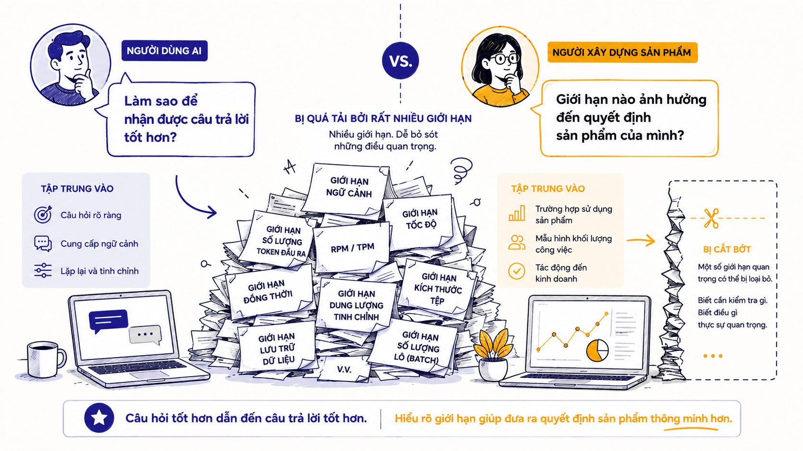
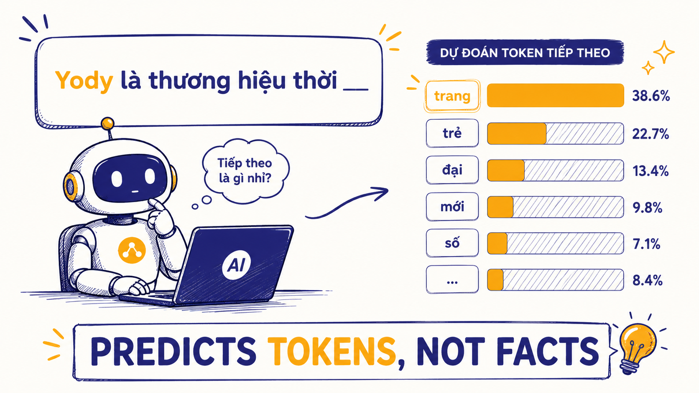
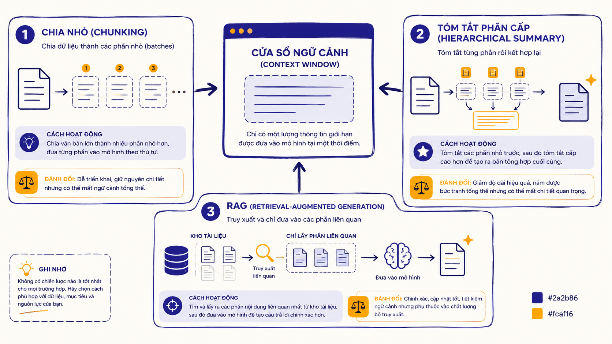
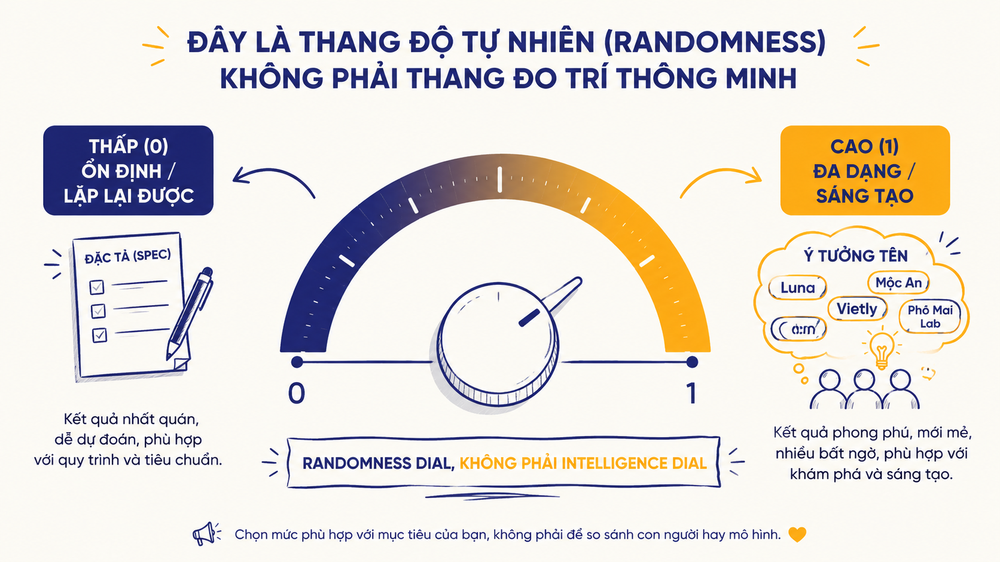
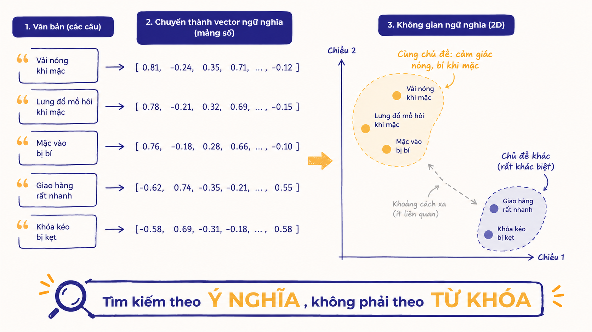
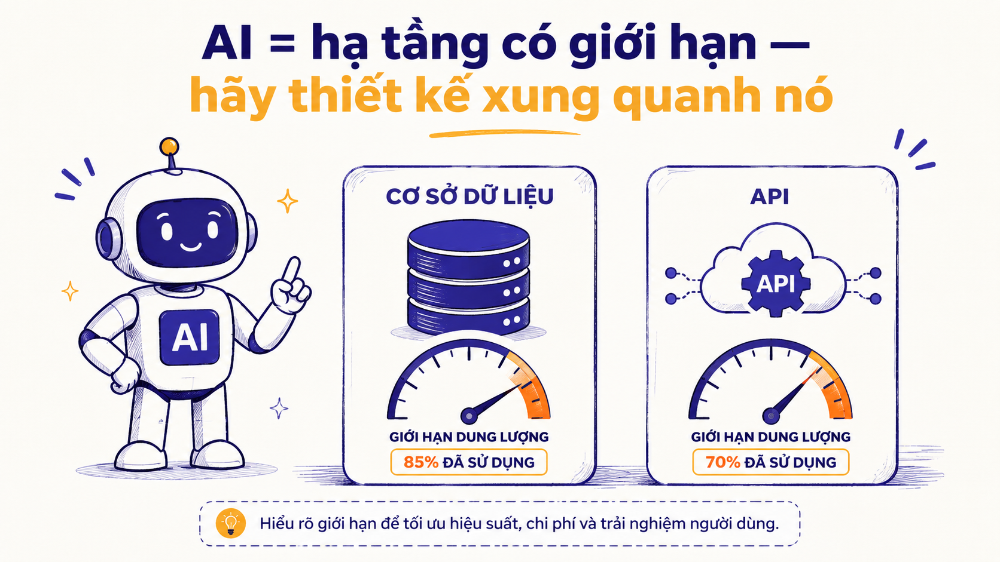

# I1.1 — AI Fundamentals
## Tài liệu học — YODY Product Builder Program

> **Module 1 · L1 Aware · 150 phút**
> Đây là tài liệu học dành cho **người học**. Bạn không cần biết lập trình để hiểu nội dung này. Mục tiêu: sau khi đọc xong, bạn giải thích được 5 khái niệm nền tảng của AI và — quan trọng hơn — biết mỗi khái niệm đó ảnh hưởng đến quyết định sản phẩm như thế nào.

---

## Mục lục

1. [Tại sao buổi học này tồn tại?](#1-tại-sao-buổi-học-này-tồn-tại)
2. [Bạn sẽ hiểu được gì sau buổi này?](#2-bạn-sẽ-hiểu-được-gì-sau-buổi-này)
3. [Khái niệm 1 — LLM thực sự làm gì: dự đoán token](#3-khái-niệm-1--llm-thực-sự-làm-gì-dự-đoán-token)
4. [Khái niệm 2 — Token: tiền, tốc độ, giới hạn](#4-khái-niệm-2--token-tiền-tốc-độ-giới-hạn)
5. [Khái niệm 3 — Context Window: bộ nhớ làm việc có hạn](#5-khái-niệm-3--context-window-bộ-nhớ-làm-việc-có-hạn)
6. [Khái niệm 4 — Temperature: thang đo tính ngẫu nhiên](#6-khái-niệm-4--temperature-núm-vặn-độ-ngẫu-nhiên)
7. [Khái niệm 5 — Embeddings: tìm theo nghĩa](#7-khái-niệm-5--embeddings-tìm-theo-nghĩa)
8. [Tổng hợp — Mọi giới hạn của AI đều là infrastructure constraint](#8-tổng-hợp--mọi-giới-hạn-của-ai-đều-là-infrastructure-constraint)
9. [An toàn dữ liệu — Quy tắc bắt buộc](#9-an-toàn-dữ-liệu--quy-tắc-bắt-buộc)
10. [Bài tập thực hành (Lab 60 phút)](#10-bài-tập-thực-hành-lab-60-phút)
11. [Bài tập về nhà](#11-bài-tập-về-nhà)
12. [Tóm tắt nhanh — 5 khái niệm × 1 hệ quả product](#12-tóm-tắt-nhanh--5-khái-niệm--1-hệ-quả-product)

---

## 1. Tại sao buổi học này tồn tại?

Hãy thử thí nghiệm nhỏ này.

Giả sử bạn đang làm việc với một tính năng AI: "Tóm tắt toàn bộ phản hồi của khách hàng về một sản phẩm để biết họ đang than phiền về điều gì." Bạn dán vào AI 30 bình luận cùng với một đoạn mô tả sản phẩm dài và yêu cầu: *"Đọc hết và liệt kê tất cả vấn đề khách than phiền."*

AI trả lời. Nhìn qua thì có vẻ ổn. Nhưng khi bạn đối chiếu kỹ, bạn nhận ra AI **đã bỏ sót một số bình luận ở đầu danh sách** — những bình luận phàn nàn về khóa kéo bị kẹt, về size không chuẩn. Nó không đề cập đến chúng dù chúng có ở đó.

Câu hỏi đặt ra: AI có cố tình bỏ qua không? AI có bị lỗi không?

Không. Đây không phải lỗi. Đây là **infrastructure constraint** — một giới hạn cố hữu trong kiến trúc mô hình, cụ thể ở đây là *context window* — và nếu bạn không biết nó tồn tại, bạn sẽ thiết kế tính năng sản phẩm theo cách đảm bảo thất bại từ đầu.

<!--
> **[IMAGE-INSIGHT]** Minh họa hai màn hình cạnh nhau: (1) người dùng thông thường hỏi AI "làm sao để câu trả lời hay hơn?", (2) builder sản phẩm hỏi "giới hạn nào của mô hình sẽ ảnh hưởng đến quyết định sản phẩm của tôi?". Phong cách: flat editorial illustration, màu #2a2b86 và #fcaf16 trên nền trắng ngà, Montserrat, 16:9.
> *(Prompt tạo hình: "Split scene: an AI user asking 'how to get a better answer?' vs a product builder asking 'which model limit affects my product decision?'; overloaded review pile being truncated on the right side — modern flat editorial illustration meets clean sketch-note style, confident hand-drawn linework with subtle marker shading, tech/office aesthetic, brand palette deep indigo #2a2b86 and warm amber #fcaf16 on off-white background, Montserrat-like geometric sans for labels, generous whitespace, minimal, professional, 16:9.")*
-->

**Đây là khác biệt cốt lõi giữa hai kiểu người làm việc với AI:**

- **Người dùng AI** hỏi: *"Làm sao để ra câu trả lời tốt hơn?"*
- **Builder sản phẩm bằng AI** hỏi: *"Giới hạn nào của mô hình sẽ ảnh hưởng đến quyết định sản phẩm của tôi — và tôi thiết kế quanh nó như thế nào?"*

Cả hai đều cần AI. Nhưng builder sản phẩm cần thêm một thứ: **hiểu AI như một hệ thống hạ tầng có giới hạn**, không phải như một phép màu vô hạn.

Buổi học này trang bị cho bạn 5 khái niệm nền tảng nhất — không phải để bạn tự viết code AI, mà để bạn **ra quyết định sản phẩm đúng** khi AI là một thành phần trong hệ thống bạn đang xây dựng.

---

## 2. Bạn sẽ hiểu được gì sau buổi này?

Cuối buổi học, bạn sẽ đạt được ba mục tiêu sau:

**Mục tiêu 1:** Giải thích được 5 khái niệm nền tảng của AI (LLM, token, context window, temperature, embeddings) và nêu được ít nhất 1 hệ quả cụ thể đối với thiết kế sản phẩm cho mỗi khái niệm.

**Mục tiêu 2:** Phân tích được một quyết định sản phẩm cụ thể liên quan đến giới hạn của cửa sổ ngữ cảnh (context window) — bao gồm: xác định điểm giới hạn nằm ở đâu, đề xuất các phương án xử lý khả thi và phân tích sự đánh đổi (bên nào chịu ảnh hưởng).

**Mục tiêu 3:** Phân biệt rõ ràng những việc AI có thể và không thể làm — đồng thời đề xuất được ít nhất 1 trường hợp ứng dụng (use case) AI phù hợp cho công việc quản lý sản phẩm của mình.

> **Lưu ý quan trọng:** Mục tiêu không phải là "thuộc định nghĩa". Nếu bạn đọc xong và chỉ nhớ được định nghĩa mà không nói được *"điều này ảnh hưởng đến thiết kế sản phẩm thế nào"* — thì bạn chưa đạt mục tiêu của buổi học.

---

## 3. Khái niệm 1 — LLM thực sự làm gì: dự đoán token

<!--
> **[IMAGE-INSIGHT]** Minh họa câu "Yody là thương hiệu thời ___" với các từ có thể điền vào cùng thanh xác suất (ví dụ: "trang" 80%, "tiết" 5%, "đại" 3%...). Bên dưới caption: "Mô hình đoán token — không tra cứu sự thật". Phong cách: flat editorial illustration, màu #2a2b86 và #fcaf16.
> *(Prompt tạo hình: "A sentence with a blank at the end — 'Yody là thương hiệu thời ___' — the model predicting the next token with probability bars showing multiple options; caption 'predicts tokens, not facts' — modern flat editorial illustration meets clean sketch-note style, confident hand-drawn linework, brand palette deep indigo #2a2b86 and warm amber #fcaf16 on off-white background, Montserrat-like geometric sans, 16:9.")*
-->

### LLM là gì?

LLM (Large Language Model — Mô hình ngôn ngữ lớn) là loại mô hình AI đứng sau các công cụ như ChatGPT, Claude, Gemini. "Lớn" ở đây không phải chỉ kích thước file — mà là số lượng tham số (parameters) khổng lồ được huấn luyện từ một lượng văn bản cực kỳ lớn: sách, bài báo, trang web, code, tài liệu học thuật...

Nhưng điều thực sự quan trọng là: **LLM làm gì bên trong?**

### Cơ chế cốt lõi: đoán từ tiếp theo

Cơ chế cốt lõi của LLM cực kỳ đơn giản về mặt nguyên lý: **dự đoán đoạn văn bản ngắn (token) tiếp theo theo xác suất**.

Hãy tưởng tượng bạn đang đọc câu: *"Yody là thương hiệu thời ___"*

Não bạn tự động nghĩ đến từ tiếp theo, đúng không? Có thể là "trang", "đại", "tiết"... LLM làm đúng điều này — nhưng thay vì bản năng, nó dùng xác suất học được từ hàng tỷ câu chữ.

Ví dụ cụ thể hơn: nếu đưa vào LLM câu *"Khách hàng phàn nàn áo bị"*, mô hình có thể dự đoán token tiếp theo là "phai" (40%), "nhăn" (25%), "lỏng" (15%), "bẩn" (10%)... và cứ thế, từng token một, cho đến khi tạo ra một câu hoàn chỉnh.

**Điều này giải thích tại sao LLM giỏi ngôn ngữ đến vậy:** vì chúng đã học từ một lượng ngôn ngữ khổng lồ, nên biết cách viết cho tự nhiên, mạch lạc, đúng ngữ pháp.

### Điều quan trọng nhất: LLM không "tra cứu sự thật"

Đây là điểm hay bị hiểu nhầm nhất và có hệ quả lớn nhất với sản phẩm.

Khi LLM trả lời một câu hỏi, nó **không mở một cơ sở dữ liệu chứa sự thật rồi tra ra câu trả lời đúng**. Nó chỉ đang sinh ra câu trả lời có **xác suất cao nhất** dựa trên các mẫu ngôn ngữ đã học.

Điều này có nghĩa là:

- LLM có thể viết rất tự tin về một sự kiện không có thật
- LLM có thể đưa ra số liệu trông rất chính xác nhưng hoàn toàn bịa
- LLM có thể trích dẫn nguồn tài liệu không tồn tại
- Tất cả những điều này được viết với giọng văn tự nhiên, rõ ràng, đáng tin

Trong ngành AI, hiện tượng này gọi là **hallucination** (ảo giác) — mô hình tạo ra nội dung trông đúng nhưng thực ra sai.

### Ví dụ thực tế tại Yody

Giả sử bạn hỏi một LLM: *"Áo khoác Yody model UW-201 có bao nhiêu màu và giá bao nhiêu?"*

LLM không có quyền truy cập vào hệ thống quản lý sản phẩm của Yody. Nó không biết model UW-201 có tồn tại không. Nhưng nó có thể trả lời một cách rất tự tin: *"Áo khoác Yody model UW-201 có 4 màu chính: xanh navy, xanh rêu, đen và trắng. Giá tham khảo từ 450.000 đến 590.000 VNĐ tùy kích cỡ."* — tất cả là bịa.

### Hệ quả đối với sản phẩm

Vì LLM đoán thay vì tra cứu:

1. **Không dùng LLM như nguồn dữ liệu thật.** Mọi con số, tên sản phẩm, ngày tháng, thông tin kỹ thuật quan trọng từ LLM đều cần được kiểm chứng từ nguồn chính thức (database, tài liệu gốc).

2. **Thiết kế luồng kiểm chứng trong sản phẩm.** Nếu bạn dùng AI để tóm tắt dữ liệu nội bộ, hãy đưa dữ liệu nội bộ đó vào prompt (thay vì nhờ AI "nhớ" từ trước) — và có cơ chế xác nhận output quan trọng.

3. **LLM mạnh ở ngôn ngữ, yếu ở sự thật.** Hãy dùng LLM cho những gì nó giỏi: viết, diễn đạt, tóm tắt, phân loại, dịch, brainstorm — không phải để lấy con số chính xác hay sự kiện thực tế mà không kiểm tra.

> **Câu tóm gọn để nhớ:** *"LLM dự đoán từ tiếp theo theo xác suất, không tra cứu sự thật — văn bản trôi chảy chưa chắc đã đúng."*

---

## 4. Khái niệm 2 — Token: tiền, tốc độ, giới hạn

### Token là gì?

Token là **đơn vị cơ bản mà LLM xử lý văn bản**. Khi bạn gửi một đoạn văn bản vào LLM, mô hình không đọc từng ký tự, cũng không đọc từng từ hoàn chỉnh — nó "tách" (tokenize) văn bản ra thành các mảnh nhỏ gọi là token.

Token có thể là:
- Một từ hoàn chỉnh: "áo", "khách", "hàng"
- Một phần của một từ: "khoác" có thể được tách thành "kho" + "ác" tùy mô hình
- Dấu câu hoặc ký tự đặc biệt: ".", ",", "!"

Quy tắc gần đúng (không chính xác tuyệt đối): **1 token tiếng Anh ≈ 4 ký tự**, tức khoảng **3/4 từ** — nói cách khác, một từ tiếng Anh thông thường tương đương **~1.3 token**.

Ví dụ: câu *"The quick brown fox"* có 4 từ ≈ 5–6 token (mỗi từ tiếng Anh thường là 1–2 token).

### Tại sao token quan trọng với sản phẩm?

Có ba lý do ảnh hưởng trực tiếp đến quyết định thiết kế sản phẩm:

#### Lý do 1: Chi phí tính theo token

Khi bạn dùng API của các mô hình AI thương mại (OpenAI, Anthropic, Google...), bạn **trả tiền theo số token**, không phải theo số lần gọi hay theo giây. Chi phí thường được tính riêng cho:

- **Input token** (prompt bạn gửi vào): ví dụ $X / 1 triệu token
- **Output token** (câu trả lời AI trả về): thường đắt hơn input, ví dụ $Y / 1 triệu token

Điều này có nghĩa là:

- Prompt dài → tốn nhiều tiền hơn
- Output dài → tốn nhiều tiền hơn (và thường đắt hơn input)
- Nếu bạn xây dựng tính năng cho 100.000 người dùng, mỗi người dùng gửi prompt 500 token → bạn đang nói đến 50 triệu input token mỗi lần chạy

Đây là lý do tại sao việc viết prompt ngắn gọn, đúng trọng tâm không chỉ là thẩm mỹ — đó là **quyết định kinh tế**.

#### Lý do 2: Tốc độ phụ thuộc vào số token

LLM sinh ra từng token một, tuần tự. Mô hình cần sinh 500 token sẽ mất gấp đôi thời gian so với sinh 250 token. Điều này ảnh hưởng trực tiếp đến **trải nghiệm người dùng** — độ trễ (latency) mà người dùng cảm nhận.

Ví dụ thực tế: nếu bạn xây tính năng "AI gợi ý câu trả lời cho nhân viên CSKH" và yêu cầu AI luôn giải thích chi tiết lý do kèm ví dụ minh họa dài 300 từ — người dùng (nhân viên) phải chờ lâu hơn đáng kể so với khi AI chỉ trả lời ngắn gọn 50 từ.

**Quyết định thiết kế:** output ngắn và cụ thể hay dài và đầy đủ — đây là sự đánh đổi giữa tốc độ và độ đầy đủ của thông tin.

#### Lý do 3: Giới hạn độ dài liên quan đến context window

Mỗi mô hình có **giới hạn tối đa số token** có thể xử lý trong một lần gọi (một request). Đây chính là *context window* — sẽ được giải thích chi tiết ở mục tiếp theo.

### Tiếng Việt tốn token hơn tiếng Anh

Đây là một điểm thực tế quan trọng khi làm sản phẩm cho thị trường Việt Nam.

Hầu hết các LLM được huấn luyện chủ yếu bằng tiếng Anh. Bộ tách từ (tokenizer) cũng được tối ưu cho tiếng Anh. Vì vậy, khi xử lý tiếng Việt — đặc biệt là tiếng Việt có dấu — mô hình thường phải tách mỗi từ thành nhiều token hơn so với từ tương đương trong tiếng Anh.

Ví dụ đơn giản:
- "shirt" (tiếng Anh) → có thể là 1 token
- "áo sơ mi" (tiếng Việt) → có thể là 3–4 token vì dấu tiếng Việt

**Hệ quả thực tế:** một tính năng xử lý review của khách hàng bằng tiếng Việt sẽ tốn nhiều token hơn đáng kể so với tính năng tương đương xử lý nội dung tiếng Anh. Khi ước tính chi phí, cần tính hệ số này vào.

> **Câu tóm gọn để nhớ:** *"Token = đơn vị tính tiền, tính thời gian, và tính giới hạn — prompt dài không miễn phí."*

---

## 5. Khái niệm 3 — Context Window: bộ nhớ làm việc có hạn

<!--
> **[IMAGE-INSIGHT]** Minh họa "cửa sổ" có kích thước cố định chứa các token. Khi nhồi quá nhiều, phần token ở đầu bị đẩy ra ngoài và rơi đi. Caption: "Nhồi nhiều ≠ tốt hơn". Phong cách: flat editorial illustration, màu #2a2b86 và #fcaf16.
> *(Prompt tạo hình: "A bounded rectangular window holding tokens as small blocks; extra tokens overflowing and falling out the back — illustrating limited working memory; caption 'more input ≠ better output' — modern flat editorial illustration, confident hand-drawn linework, brand palette deep indigo #2a2b86 and warm amber #fcaf16 on off-white background, Montserrat-like labels, 16:9.")*
-->

### Context window là gì?

Context window (cửa sổ ngữ cảnh) là **bộ nhớ làm việc của mô hình trong một lần gọi (một request)**. Nó định nghĩa số token tối đa mà mô hình có thể "nhìn thấy" và xử lý trong một lần gọi.

Để hình dung, hãy tưởng tượng bạn đang làm việc trên một tờ giấy có kích thước cố định. Tờ giấy đó chỉ chứa được một số lượng từ giới hạn. Khi bạn viết thêm vào cuối, phần đầu sẽ bị đẩy ra ngoài tầm nhìn. Mô hình AI chỉ "thấy" những gì đang nằm trong tờ giấy đó — phần bị đẩy ra thì không còn tồn tại với nó nữa.

Ví dụ: mô hình có context window 128.000 token có thể xử lý khoảng 100.000 từ tiếng Anh trong một lần (ít hơn với tiếng Việt). Nghe có vẻ nhiều — nhưng sẽ thấy ngay tại sao vẫn có thể không đủ trong nhiều tình huống thực tế.

### Quay lại ví dụ mở đầu: tại sao AI bỏ sót review?

Quay lại thí nghiệm ở phần đầu: bạn dán 30 review cộng với một đoạn mô tả sản phẩm dài. Khi AI xử lý đến cuối danh sách, nó ưu tiên "ghi nhớ" phần gần nhất (cuối). Phần đầu — dù vẫn nằm trong context window — bị "chú ý ít hơn" do cách mô hình hoạt động khi xử lý chuỗi dài.

Kết quả: AI tóm tắt tốt các review ở cuối, bỏ sót hoặc gộp chung các review ở đầu. Đây không phải lỗi phần mềm — đây là đặc tính của kiến trúc mô hình.

### Quan niệm sai lầm phổ biến: "nhồi nhiều = tốt hơn"

Nhiều người khi mới làm việc với AI hay nghĩ: *"Càng cung cấp nhiều thông tin cho AI thì kết quả càng tốt."* Đây là quan niệm **sai** và nguy hiểm trong thiết kế sản phẩm.

Thực tế:
- Nhồi quá nhiều dữ liệu không liên quan làm loãng thông tin quan trọng
- AI có xu hướng chú ý hơn vào phần gần đầu và gần cuối của prompt (lost-in-the-middle effect)
- Nhồi nhiều tốn nhiều token hơn → tốn tiền hơn, chậm hơn
- Phần thông tin quan trọng ở giữa có thể bị bỏ qua

**Câu tóm gọn để nhớ:** *"Nhồi nhiều ≠ tốt hơn."*

### Ba chiến lược thiết kế quanh context window

<!--
> **[IMAGE-INSIGHT]** Ba ô cạnh nhau mô tả ba chiến lược: (1) Chunking — chia dữ liệu thành batch nhỏ, xử lý từng batch; (2) Tóm tắt phân tầng — tóm tắt từng phần rồi tổng hợp; (3) RAG — chỉ kéo phần liên quan vào. Mỗi ô có tag nhỏ ghi trade-off. Phong cách: flat editorial illustration, màu #2a2b86 và #fcaf16.
> *(Prompt tạo hình: "Three labeled strategy panels around a context window diagram: (1) Chunking — split data into batches, (2) Hierarchical Summary — summarize parts then combine, (3) RAG — retrieve only relevant sections; each panel has a small trade-off tag — modern flat editorial illustration, confident hand-drawn linework, brand palette deep indigo #2a2b86 and warm amber #fcaf16 on off-white background, Montserrat labels, 16:9.")*
-->

Vì context window có giới hạn, người thiết kế sản phẩm AI cần chủ động xử lý dữ liệu trước khi đưa vào mô hình. Có ba chiến lược phổ biến:

---

#### Chiến lược 1: Chunking (Chia nhỏ theo batch)

**Cách hoạt động:** Thay vì nhồi toàn bộ dữ liệu vào một lần, bạn chia nhỏ dữ liệu thành các phần (chunk) có kích thước vừa phải, xử lý từng phần riêng, rồi gộp kết quả lại.

**Ví dụ thực tế tại Yody:** Thay vì dán 30 review vào một lần, bạn chia thành 3 batch mỗi batch 10 review:

- Gửi batch 1 (review 1–10): *"Liệt kê vấn đề khách than, kèm số review nhắc đến."*
- Gửi batch 2 (review 11–20): tương tự
- Gửi batch 3 (review 21–30): tương tự
- Gửi tổng hợp: *"Đây là 3 bản tóm tắt từ 3 batch. Gộp và xếp theo tần suất."*

**Kết quả:** danh sách vấn đề đầy đủ hơn nhiều, không sót.

**Sự đánh đổi (Trade-off) — Bên nào chịu ảnh hưởng:**

| Lợi ích mang lại | Chi phí & Hạn chế |
|---------|---------|
| Đảm bảo bao quát toàn bộ dữ liệu, không bỏ sót thông tin quan trọng. | Phải gọi API nhiều lần hơn → làm tăng tổng chi phí sử dụng. |
| Hạn chế tối đa việc bỏ sót thông tin. | Tăng tổng thời gian phản hồi (latency) vì hệ thống phải đợi xử lý nhiều lượt. |
| Dễ dàng triển khai về mặt kỹ thuật mà không cần hạ tầng phức tạp. | Cần xây dựng thêm logic để tổng hợp các kết quả đơn lẻ ở bước cuối. |

---

#### Chiến lược 2: Tóm tắt phân tầng (Hierarchical Summary)

**Cách hoạt động:** Thay vì xử lý dữ liệu thô, bạn tóm tắt từng phần trước, rồi đưa các bản tóm tắt đó vào bước xử lý tiếp theo. Giống như cách báo cáo trong tổ chức: nhân viên → tổ trưởng → trưởng phòng — mỗi cấp nhận bản tóm tắt, không phải toàn bộ chi tiết.

**Ví dụ thực tế tại Yody:** Lịch sử chat CSKH của một khách hàng 2 năm gồm ~400 tin nhắn — không thể nhồi hết vào một lần. Giải pháp:

1. Tóm tắt lịch sử theo từng quý: Q3/2024, Q4/2024, Q1/2025, Q2/2025...
2. Khi nhân viên cần tra cứu, đưa vào prompt: (a) 4–6 bản tóm tắt theo quý + (b) 10 tin nhắn gần nhất nguyên văn.
3. AI có đủ context để trả lời mà không cần toàn bộ 400 tin nhắn.

**Sự đánh đổi (Trade-off) — Bên nào chịu ảnh hưởng:**

| Lợi ích mang lại | Chi phí & Hạn chế |
|---------|---------|
| Tiết kiệm dung lượng cửa sổ ngữ cảnh (context window) đáng kể. | Có thể làm mất đi các chi tiết nhỏ khi tóm tắt. |
| Phù hợp với các tệp dữ liệu cực kỳ dài. | Rủi ro bỏ qua những sắc thái biểu đạt quan trọng. |
| Giúp giảm thiểu tối đa chi phí token. | Yêu cầu phải có bước tiền xử lý (tóm tắt) từ trước, làm tăng thêm một khâu. |

---

#### Chiến lược 3: RAG (Retrieval-Augmented Generation)

**Cách hoạt động:** Thay vì nhồi toàn bộ dữ liệu, hệ thống **tìm và kéo ra** chỉ những phần dữ liệu *liên quan đến câu hỏi cụ thể* rồi mới đưa vào context. Đây là chiến lược phức tạp hơn về mặt kỹ thuật nhưng cực kỳ hiệu quả.

**Ví dụ thực tế tại Yody:** Nhân viên CSKH đang trả lời khách về vấn đề "đổi trả". Thay vì đưa toàn bộ lịch sử 400 tin nhắn vào, hệ thống RAG:

1. Phân tích câu hỏi hiện tại: chủ đề là "đổi trả"
2. Tìm trong lịch sử các đoạn chat liên quan đến đổi trả
3. Chỉ kéo ra những đoạn đó (ví dụ: 15 tin nhắn liên quan) và đưa vào prompt
4. AI có đúng thông tin cần thiết, không bị ngập trong dữ liệu không liên quan

**Sự đánh đổi (Trade-off) — Bên nào chịu ảnh hưởng:**

| Lợi ích mang lại | Chi phí & Hạn chế |
|---------|---------|
| Độ chính xác rất cao nhờ cung cấp đúng ngữ cảnh cần thiết. | Cấu trúc kỹ thuật phức tạp hơn nhiều so với các phương án khác. |
| Tiết kiệm token tối đa (chỉ gửi phần thực sự cần thiết). | Yêu cầu phải thiết lập và duy trì hạ tầng Vector Database (Cơ sở dữ liệu vectơ). |
| Có khả năng mở rộng (scale) tốt với kho dữ liệu khổng lồ. | Chi phí thiết lập ban đầu và vận hành hệ thống cao hơn. |

---

#### Khi nào dùng chiến lược nào?

| Tình huống | Chiến lược phù hợp |
|----------|-------------------|
| Lượng dữ liệu vừa phải và yêu cầu xử lý trọn vẹn. | Chia nhỏ dữ liệu (Chunking) |
| Tài liệu quá dài và không yêu cầu trích xuất chi tiết vụn vặt. | Tóm tắt phân tầng |
| Hệ thống dữ liệu lớn, đòi hỏi độ chính xác cao và có đội ngũ kỹ thuật hỗ trợ. | Truy xuất tăng cường (RAG) |
| Dành cho nhu cầu sử dụng nội bộ, yêu cầu đơn giản, ngân sách và nhân lực kỹ thuật còn hạn chế. | Kết hợp Chunking + Tóm tắt phân tầng |

**Điều quan trọng cần nhớ:** *việc chọn chiến lược nào là một quyết định thiết kế sản phẩm*, không phải là thứ tự động xảy ra. Bạn phải chủ động nghĩ đến điều này khi thiết kế bất kỳ tính năng AI nào xử lý lượng dữ liệu đáng kể.

> **Câu tóm gọn để nhớ:** *"Context window = bộ nhớ làm việc có hạn — nhồi quá thì phần cũ bị mất, thiết kế sản phẩm phải xử lý điều này."*

---

## 6. Khái niệm 4 — Temperature: thang đo tính ngẫu nhiên

<!--
> **[IMAGE-INSIGHT]** Thanh trượt từ 0 đến 1. Phía trái (gần 0): biểu tượng ổn định, lặp lại, ví dụ "viết spec kỹ thuật". Phía phải (gần 1): biểu tượng đa dạng, sáng tạo, ví dụ "đặt tên sản phẩm". Chú thích: "Không phải núm độ thông minh — là núm độ ngẫu nhiên". Phong cách: flat editorial illustration, màu #2a2b86 và #fcaf16.
> *(Prompt tạo hình: "A slider from 0 to 1: left side (low) labeled stable/repeatable with a spec-writing icon, right side (high) labeled diverse/creative with a naming brainstorm icon; a dial metaphor, not an IQ meter; caption 'randomness dial, not intelligence dial' — modern flat editorial illustration, confident hand-drawn linework, brand palette deep indigo #2a2b86 and warm amber #fcaf16 on off-white background, Montserrat labels, 16:9.")*
-->

### Temperature là gì?

Temperature (nhiệt độ) là một tham số điều khiển **mức độ ngẫu nhiên** trong cách LLM chọn từ tiếp theo khi sinh ra câu trả lời.

Hãy nhớ lại cơ chế dự đoán token: mô hình có một danh sách các token có thể xuất hiện tiếp theo, mỗi token kèm một xác suất. Temperature quyết định mô hình chọn token theo cách nào:

- **Temperature thấp (gần 0):** mô hình gần như luôn chọn token có xác suất cao nhất → kết quả ổn định, lặp lại, có thể dự đoán
- **Temperature cao (gần 1 hoặc cao hơn):** mô hình đôi khi chọn những token có xác suất thấp hơn → kết quả đa dạng, ít lặp lại, sáng tạo hơn — nhưng cũng kém nhất quán hơn

### Temperature KHÔNG phải là độ thông minh

**Lưu ý quan trọng:** temperature không làm cho AI thông minh hơn hay ngu hơn — nó chỉ điều chỉnh sự biến thiên trong output.

Một ví dụ cho dễ hình dung: hãy nghĩ đến một nhân viên rất giỏi.

- **Temperature thấp** = nhân viên đó trong trạng thái làm việc chính xác, cẩn thận, theo quy trình, trả lời như nhau với cùng một câu hỏi.
- **Temperature cao** = nhân viên đó trong trạng thái brainstorm thoải mái, đưa ra nhiều ý tưởng khác nhau, đôi khi táo bạo, đôi khi kỳ lạ.

Cả hai đều là cùng một người, cùng năng lực — chỉ khác trạng thái làm việc.

### Ví dụ thực tế: cùng một prompt, hai temperature khác nhau

**Prompt:** *"Đề xuất 5 tên cho dòng áo khoác gió đô thị của Yody."*

**Temperature ≈ 0.2 (thấp) — chạy hai lần:**
- Lần 1: Urban Shield, City Wind, Metro Layer, Street Breeze, Urban Core
- Lần 2: Urban Shield, City Wind, Urban Layer, Metro Breeze, Street Core

Kết quả: hai lần gần giống nhau, an toàn, hơi nhàm.

**Temperature ≈ 0.9 (cao) — chạy hai lần:**
- Lần 1: Mây Đô Thị, WindRider, Phố Gió, Urban Cocoon, CityShell
- Lần 2: NightBreeze, Gió Sài Gòn, MetroWrap, Lớp Phố, WindSilk

Kết quả: hai lần rất khác nhau, nhiều tên sáng tạo hơn, nhưng cũng có tên nghe "lạ" hoặc không phù hợp.

### Chọn temperature như thế nào?

Temperature là **một lựa chọn thiết kế sản phẩm**. Không có giá trị nào là "đúng tuyệt đối" — tùy thuộc vào tác vụ bạn đang thiết kế.

| Loại tác vụ | Temperature nên dùng | Lý do |
|------------|---------------------|-------|
| Trích xuất thông tin từ văn bản | Thấp (0.1–0.3) | Cần nhất quán, không sáng tạo |
| Viết mô tả sản phẩm chuẩn | Thấp (0.2–0.4) | Cần độ chính xác, giọng nhất quán |
| Phân loại đánh giá khách hàng | Thấp (0.1–0.2) | Cần kết quả ổn định để so sánh |
| Brainstorm tên sản phẩm | Cao (0.7–1.0) | Muốn đa dạng, sáng tạo |
| Viết content marketing | Trung bình-cao (0.5–0.8) | Cần vừa có chất lượng vừa đa dạng |
| Gợi ý câu trả lời CSKH | Trung bình (0.3–0.5) | Cần tự nhiên nhưng không quá tùy tiện |

**Lưu ý thực tế:** nhiều API cho phép bạn đặt temperature khi gọi mô hình. Khi thiết kế tính năng AI, bạn cần quyết định giá trị mặc định và có cho phép người dùng điều chỉnh không.

> **Câu tóm gọn để nhớ:** *"Temperature = núm ngẫu nhiên, không phải núm thông minh — chọn thấp khi cần ổn định, chọn cao khi cần sáng tạo."*

---

## 7. Khái niệm 5 — Embeddings: tìm theo nghĩa

<!--
> **[IMAGE-INSIGHT]** Minh họa văn bản chuyển thành vector (dãy số). Các câu gần nghĩa ("vải nóng", "mặc bí mồ hôi", "đổ mồ hôi lưng") nằm gần nhau trong không gian 2D. Các câu không liên quan ("giao hàng nhanh", "khóa kéo bị kẹt") nằm xa nhau. Phong cách: flat editorial illustration, màu #2a2b86 và #fcaf16.
> *(Prompt tạo hình: "Text chunks converting into semantic vectors (arrays of numbers); near-meaning sentences like 'hot fabric', 'sweaty back', 'stuffy when worn' clustering close together in 2D space; unrelated sentences like 'fast delivery' and 'zipper stuck' positioned far away; caption 'search by meaning, not keywords' — modern flat editorial illustration, confident hand-drawn linework, brand palette deep indigo #2a2b86 and warm amber #fcaf16 on off-white background, Montserrat labels, 16:9.")*
-->

### Vấn đề với tìm kiếm theo từ khóa

Hãy thử tình huống này: bạn muốn tìm tất cả review của khách hàng **phàn nàn về việc áo bí, không thoáng**. Bạn tìm kiếm từ khóa "nóng" và "bí".

Kết quả tìm kiếm sẽ trả về:
- Review #7: *"Mặc vào nóng quá nếu trời không lạnh hẳn."* ✓
- Review #12: *"Vải bí, đi bộ lâu thấy bí mồ hôi lưng."* ✓
- Review #30: *"Vải nóng, mùa thu miền Nam mặc không nổi."* ✓

Nhưng sẽ **bỏ sót** những review này:
- Review #20: *"Không thoáng khí, trời 28 độ mặc là đổ mồ hôi."* ✗ (không có chữ "nóng" hay "bí")

Đây là giới hạn của tìm kiếm theo từ khóa: nó tìm **ký tự trùng khớp**, không hiểu **nghĩa**.

### Embeddings giải quyết vấn đề này như thế nào?

Embeddings là kỹ thuật **biến văn bản thành một vector ngữ nghĩa** — một dãy số biểu diễn ý nghĩa của văn bản đó trong không gian toán học.

Nghe phức tạp, nhưng ý tưởng cốt lõi rất đơn giản: **những câu có nghĩa gần nhau sẽ có vector gần nhau**. Và "gần" ở đây được đo bằng toán học (khoảng cách giữa các vector trong không gian nhiều chiều).

Ví dụ:
- *"Vải nóng"* → vector [0.8, 0.3, 0.2, ...]
- *"Đổ mồ hôi lưng"* → vector [0.79, 0.31, 0.18, ...]
- *"Không thoáng khí"* → vector [0.77, 0.33, 0.22, ...]
- *"Khóa kéo bị kẹt"* → vector [0.1, 0.9, 0.5, ...] ← rất khác

Khi bạn tìm kiếm bằng embeddings với query "vải nóng bí", hệ thống:
1. Biến query của bạn thành vector
2. Tìm tất cả văn bản có vector **gần** với vector của query
3. Trả về kết quả dù không có từ khóa trùng khớp chính xác

Kết quả: hệ thống tìm được cả review #20 (*"Không thoáng khí, đổ mồ hôi"*) dù không có chữ "nóng" hay "bí".

### Ba ứng dụng thực tế cho sản phẩm Yody

Embeddings là nền tảng của nhiều tính năng AI phổ biến. Ở mức L1 (buổi học này), bạn chỉ cần hiểu ý tưởng cốt lõi — không cần biết cách code.

#### Ứng dụng 1: Phân tích review theo chủ đề

**Bài toán:** Bạn có 10.000 review từ khách hàng. Bạn muốn gom nhóm chúng theo chủ đề: vải/chất liệu, size/form, giá cả, đổi trả, giao hàng...

**Cách tìm theo từ khóa:** Phải định nghĩa trước danh sách từ khóa cho mỗi chủ đề, bỏ sót những review dùng cách diễn đạt khác.

**Cách dùng embeddings:** Biến mỗi review thành vector, dùng thuật toán gom cụm (clustering) để nhóm các vector gần nhau lại. Các cụm sẽ tự nhiên ứng với các chủ đề thực — kể cả những chủ đề bạn chưa nghĩ đến.

#### Ứng dụng 2: Gợi ý sản phẩm tương tự

**Bài toán:** Khách đang xem áo khoác gió Urban Wind. Bạn muốn gợi ý các sản phẩm tương tự.

**Cách tìm theo từ khóa:** Chỉ gợi ý được sản phẩm cùng danh mục (áo khoác) — thiếu tinh tế.

**Cách dùng embeddings:** Biến mô tả sản phẩm thành vector. Tìm các sản phẩm có vector gần nhất (tương tự về đặc tính: nhẹ, đô thị, chống gió...) — kết quả phong phú và thông minh hơn.

#### Ứng dụng 3: Tìm kiếm thông minh trong hệ thống nội bộ

**Bài toán:** Nhân viên muốn tìm tài liệu về "chính sách đổi trả áo bị lỗi vải" trong hệ thống nội bộ.

**Cách tìm theo từ khóa:** Phải gõ đúng từ trong tiêu đề tài liệu.

**Cách dùng embeddings:** Hệ thống hiểu ý nghĩa query và tìm tài liệu liên quan kể cả khi tên tài liệu không chứa đúng từ khóa đó.

### Ở cấp độ này bạn cần hiểu gì?

Với buổi học I1.1, bạn chỉ cần nắm:

1. **Embeddings biến văn bản thành vector số để so khớp theo nghĩa**, không phải theo ký tự
2. **Câu gần nghĩa → vector gần nhau** trong không gian số
3. Đây là nền tảng của: tìm kiếm theo nghĩa, gợi ý sản phẩm tương tự, gom cụm phản hồi
4. Khi bạn thiết kế tính năng "tìm sản phẩm tương tự" hay "phân tích review theo chủ đề", embeddings thường là phương án tốt hơn tìm từ khóa

Bạn **không cần** biết toán học vector hay cách code embeddings ở giai đoạn này.

> **Câu tóm gọn để nhớ:** *"Embeddings = biến text thành số để so nghĩa — tìm được cả những gì người ta nói khác chữ nhưng cùng ý."*

---

## 8. Tổng hợp — Mọi giới hạn của AI đều là infrastructure constraint

Bây giờ hãy đứng lùi ra và nhìn toàn bức tranh.

Bạn vừa học 5 khái niệm:
- LLM dự đoán token → có thể bịa
- Token gắn với chi phí và tốc độ → có giới hạn về tiền và thời gian
- Context window hữu hạn → không thể nhồi vô hạn dữ liệu
- Temperature kiểm soát ngẫu nhiên → cần chọn đúng cho từng tác vụ
- Embeddings tìm theo nghĩa → hiệu quả hơn từ khóa

Điểm chung của tất cả những điều này là gì?

**Tất cả đều là infrastructure constraint** — không phải lỗi, không phải sự cố kỹ thuật, mà là đặc tính vốn có trong kiến trúc của mô hình.

<!--
> **[IMAGE-INSIGHT]** Minh họa AI đứng cạnh DATABASE và API, cả ba đều có đồng hồ đo giới hạn (gauge). Caption: "AI cũng là infrastructure — có giới hạn như mọi hệ thống khác". Phong cách: flat editorial illustration, màu #2a2b86 và #fcaf16.
> *(Prompt tạo hình: "AI model icon standing beside DATABASE and API blocks, all three with limit gauges showing capacity constraints; caption 'AI = infrastructure with limits — design around it' — modern flat editorial illustration, confident hand-drawn linework, brand palette deep indigo #2a2b86 and warm amber #fcaf16 on off-white background, Montserrat labels, 16:9.")*
-->

### So sánh với infrastructure quen thuộc

Trong kỹ thuật phần mềm, không ai nói *"database thần kỳ, không có giới hạn"* hay *"API có thể xử lý vô hạn request"*. Ai cũng hiểu:

- Database có giới hạn dung lượng, tốc độ query, số connection đồng thời
- API có rate limit, timeout, latency
- Server có CPU, RAM, bandwidth

Và khi thiết kế sản phẩm, bạn **phải tính đến** những giới hạn đó: cache, pagination, retry logic, async processing...

**AI cũng như vậy.** Token là giới hạn về chi phí và tốc độ. Context window là giới hạn về bộ nhớ làm việc. Hallucination là giới hạn về độ tin cậy. Temperature cần được chọn phù hợp với từng tác vụ — chọn sai sẽ khiến output thiếu ổn định (temperature quá cao) hoặc quá nhàm (temperature quá thấp).

### Tư duy builder sản phẩm

Đây là điểm khác biệt lớn nhất giữa người dùng AI và builder sản phẩm bằng AI:

**Người dùng AI nghĩ:**
> *"AI này hay đấy, mình sẽ dùng nó để làm X."*

**Builder sản phẩm bằng AI nghĩ:**
> *"AI này có giới hạn A, B, C. Để tính năng X hoạt động đúng, mình cần thiết kế luồng xử lý quanh giới hạn A (chunking), kiểm chứng output tránh rủi ro B (hallucination), và chọn temperature phù hợp cho C."*

Toàn bộ chương trình Product Builder này được xây dựng dựa trên tư duy thứ hai.

### Bảng tổng kết: 5 khái niệm × hệ quả product

| Khái niệm | Bản chất (1 câu) | Hệ quả với quyết định sản phẩm |
|-----------|-----------------|-------------------------------|
| **LLM dự đoán token** | Đoán từ tiếp theo theo xác suất, không tra cứu sự thật | Output trông đúng nhưng có thể sai → luôn cần cơ chế kiểm chứng cho dữ liệu quan trọng |
| **Token** | Đơn vị xử lý — gắn với tiền, tốc độ, giới hạn | Prompt dài = tốn tiền hơn, chậm hơn → phải cân nhắc khi thiết kế feature |
| **Context window** | Bộ nhớ làm việc hữu hạn — nhồi quá thì phần cũ bị mất | Không nhồi tất cả dữ liệu → phải chunking / tóm tắt / RAG |
| **Temperature** | Núm điều chỉnh độ ngẫu nhiên của output | Tác vụ cần chính xác → dùng thấp; cần sáng tạo → dùng cao; đây là lựa chọn thiết kế |
| **Embeddings** | Biến text thành vector để so khớp theo nghĩa | Tìm kiếm / gợi ý / gom cụm nên dùng semantic search thay vì từ khóa |

---

## 9. An toàn dữ liệu — Quy tắc bắt buộc

Phần này không phải để biết cho vui — đây là **quy tắc cứng** áp dụng ngay từ buổi đầu tiên.

### Tại sao dữ liệu là vấn đề với AI?

Khi bạn dán văn bản vào một công cụ AI công cộng (ChatGPT, Claude.ai, Gemini...), dữ liệu đó có thể được:

- **Lưu trữ trên server** của nhà cung cấp
- **Dùng để huấn luyện** mô hình tương lai (tùy điều khoản dịch vụ)
- **Truy cập bởi nhân viên** nhà cung cấp trong một số điều kiện

Điều này đặt ra vấn đề nghiêm trọng nếu bạn dán vào AI các thông tin như:
- Tên, số điện thoại, email của khách hàng thật
- Nội dung chat CSKH thực với thông tin cá nhân của khách
- Thông tin đơn hàng thật có tên/địa chỉ khách

### Quy định pháp lý tại Việt Nam

Từ **01/01/2026**, Luật Bảo vệ dữ liệu cá nhân (Luật 91/2025/QH15) và Nghị định 356/2025/NĐ-CP có hiệu lực. Một số điểm chính liên quan trực tiếp đến làm việc với AI:

- **Dữ liệu cá nhân** (tên, địa chỉ, số điện thoại, email, nội dung giao tiếp...) chỉ được xử lý khi có sự đồng ý của chủ thể
- **Không được chuyển giao** dữ liệu cá nhân ra ngoài phạm vi đã được đồng ý
- Dán thông tin khách hàng thật vào AI công cộng có thể bị coi là vi phạm

### Quy tắc cụ thể trong buổi học và công việc

**Quy tắc 1:** Toàn bộ dữ liệu trong bài tập, lab và demo của chương trình này là **dữ liệu giả lập** — không có thông tin khách hàng thật. Đây là quy định cứng.

**Quy tắc 2:** Cấm dán review thật có tên/thông tin khách, nội dung chat CSKH thật có PII (Personally Identifiable Information — thông tin định danh cá nhân) vào các công cụ AI công cộng.

**Quy tắc 3:** Nếu công việc thực tế yêu cầu xử lý dữ liệu thật bằng AI, phải thực hiện **ẩn danh hóa** (anonymization) trước: xóa tên, thay số điện thoại bằng placeholder, xóa địa chỉ... Chỉ sau đó mới đưa vào AI.

**Quy tắc 4:** Với hệ thống AI nội bộ của công ty (nếu có), tuân thủ hướng dẫn riêng về phân loại dữ liệu được phép đưa vào.

> Chúng ta sẽ học chi tiết hơn về an toàn dữ liệu và hallucination trong buổi tiếp theo (I1.2).

---

## 10. Bài tập thực hành (Lab 60 phút)

### Tình huống bài tập

Bạn đang thiết kế tính năng: **"AI tóm tắt toàn bộ lịch sử chat CSKH của một khách hàng để gợi ý câu trả lời phù hợp cho nhân viên"**.

Giả định: khách hàng này đã mua và liên hệ CSKH trong 2 năm. Lịch sử chat gồm khoảng 400 tin nhắn, bao gồm cả tin nhắn của khách và nhân viên.

---

### Phần A — Phân tích quyết định product (30 phút)

Trả lời ba câu hỏi sau cho tình huống bài tập trên. Viết câu trả lời cụ thể, không chung chung.

**Câu 1:** Tính năng này **đụng giới hạn context window ở đâu**? Mô tả cụ thể điểm nào trong luồng xử lý sẽ gặp vấn đề nếu không xử lý đúng.

**Câu 2:** **Phương án xử lý** nào phù hợp? Lựa chọn một hoặc kết hợp các chiến lược (chunking / tóm tắt phân tầng / RAG) và giải thích tại sao bạn chọn cách đó cho tình huống này.

**Câu 3:** **Trade-off là gì — ai trả giá?** Với mỗi phương án bạn đề xuất, nêu rõ hai điểm:
- (a) Điều gì bị đánh đổi
- (b) Ai là người chịu hậu quả — nhân viên CSKH, khách hàng, đội kỹ thuật hay doanh nghiệp?

---

### Phần B — Bảng 5 khái niệm × hệ quả product (20 phút)

Điền vào bảng sau. Cột "Hệ quả với product" phải là ví dụ cụ thể từ công việc của bạn tại Yody — **không chép định nghĩa**, không viết chung chung.

| Khái niệm | Hệ quả với product (ví dụ cụ thể của bạn) |
|-----------|------------------------------------------|
| LLM dự đoán token (có thể bịa) | |
| Token (tiền, tốc độ, giới hạn) | |
| Context window (bộ nhớ hữu hạn) | |
| Temperature (núm ngẫu nhiên) | |
| Embeddings (tìm theo nghĩa) | |

---

### Phần C — Use case cá nhân (10 phút)

Viết **1 use case AI** cho công việc product của bạn. Không cần hoàn hảo — đây là "bản nháp" để phát triển ở buổi sau (I1.2).

Cấu trúc gợi ý:
- **Tác vụ:** [mô tả việc bạn muốn AI làm]
- **Đầu vào:** [dữ liệu nào sẽ được đưa vào AI]
- **Đầu ra mong đợi:** [AI sẽ trả về gì]
- **Giới hạn AI nào có thể ảnh hưởng:** [context window? hallucination? temperature?]

---

### Dữ liệu mẫu dùng trong lab

> ⚠️ Dữ liệu dưới đây **hoàn toàn là giả lập**, không tương ứng với sản phẩm hay khách hàng thật nào của Yody. Chỉ dùng cho mục đích học tập.

**Mô tả sản phẩm mẫu:**

> *"Áo khoác gió Yody Urban Wind — áo nhẹ chống gió cho người đi xe máy đô thị, gấp gọn bỏ balo, có mũ tháo rời, chống nước nhẹ. Màu: be, xanh than, rêu, đỏ đô. Size S–XXL. Giá 590.000 VNĐ."*

**30 review giả lập:**

1. Áo nhẹ, mặc đi xe máy buổi sáng ấm vừa đủ, ưng.
2. Khóa kéo bị kẹt sau 2 tuần, hơi bực.
3. Màu be ngoài đời nhạt hơn ảnh trên web.
4. Vải kêu sột soạt khi đi, hơi khó chịu nơi yên tĩnh.
5. Mũ tháo rời tiện, mưa phùn không ướt.
6. Size M hơi rộng vai so với bảng size.
7. Mặc vào nóng quá nếu trời không lạnh hẳn.
8. Giá hợp lý so với chất lượng, sẽ mua thêm màu khác.
9. Đường may ở nách bị tưa sau 1 tháng.
10. Giao hàng nhanh, đóng gói ổn.
11. Khóa kéo chính kéo nặng tay.
12. Vải bí, đi bộ lâu thấy bí mồ hôi lưng.
13. Form đẹp, dáng gọn, hợp người nhỏ.
14. Màu xanh than lên rất đẹp, đúng ảnh.
15. Túi hơi nông, điện thoại to dễ rơi.
16. Mặc mưa to vẫn thấm, chỉ hợp mưa phùn.
17. Chất ổn trong tầm giá, không có gì để chê nhiều.
18. Cổ áo hơi cao gây cấn khi quay đầu.
19. Giặt máy xong bị xù nhẹ ở tay áo.
20. Không thoáng khí, trời 28 độ mặc là đổ mồ hôi.
21. Logo thêu chắc, không bong.
22. Dây rút mũ hơi ngắn, khó siết.
23. Đổi trả dễ, nhân viên hỗ trợ nhanh.
24. Size XXL vẫn ôm bụng, nên làm rộng hơn.
25. Mặc layer bên trong áo len thì chật.
26. Màu đỏ đô đẹp, được khen nhiều.
27. Khóa kéo túi bên trái lỏng, tự tụt.
28. Gió mạnh vẫn lùa qua nẹp áo trước.
29. Đáng tiền, mặc đi làm hợp.
30. Vải nóng, mùa thu miền Nam mặc không chịu nổi.

> **Gợi ý để thử nghiệm:** Các cụm vấn đề lặp lại nhiều nhất trong 30 review này là: **khóa kéo** (#2, #11, #27), **vải nóng/bí** (#7, #12, #20, #30), **size** (#6, #24, #25). Khi thử demo với AI, hãy kiểm tra xem AI có bỏ sót cụm nào không khi bạn nhồi tất cả một lần vs. chia batch.

---

### Tiêu chí hoàn thành lab

Bài làm đạt yêu cầu khi:

- **Phần A:** Chỉ rõ được điểm đụng context window + đề xuất ít nhất 1 phương án xử lý + nêu được trade-off "ai trả giá" một cách cụ thể.
- **Phần B:** Mỗi dòng trong bảng là ví dụ cụ thể từ công việc product thực tế, không chỉ là định nghĩa.
- **Phần C:** Viết được 1 use case có đủ 4 thành phần (tác vụ, đầu vào, đầu ra, giới hạn).

---

## 11. Bài tập về nhà

Trước buổi I1.2 (Giới hạn AI & An toàn dữ liệu), hoàn thành bài tập sau:

**Chọn 1 tác vụ thật** trong initiative/dự án bạn đang theo dõi tại Yody. Mô tả:

1. Tác vụ đó là gì?
2. Nếu dùng AI cho tác vụ này, nó sẽ đụng giới hạn nào (context window? hallucination? temperature? hay không cần AI)?
3. Theo bạn, đây có phải là use case phù hợp cho AI không? Tại sao?

Nộp bài viết ngắn (khoảng 200–300 từ) trước buổi I1.2.

---

## 12. Tóm tắt nhanh — 5 khái niệm × 1 hệ quả product

Đây là bảng bạn nên có thể điền vào thuần thục sau khi hoàn thành buổi học này. Dán lên bàn làm việc hoặc lưu vào note để nhắc nhở.

| Khái niệm | Câu tóm gọn | Hệ quả product quan trọng nhất |
|-----------|-------------|-------------------------------|
| **LLM dự đoán token** | Dự đoán từ tiếp theo, không tra sự thật | Kiểm chứng mọi thông tin quan trọng từ AI |
| **Token** | Đơn vị = tiền + tốc độ + giới hạn | Thiết kế prompt ngắn gọn, đúng trọng tâm |
| **Context window** | Bộ nhớ làm việc hữu hạn | Dùng chunking / tóm tắt / RAG, không nhồi tất cả |
| **Temperature** | Núm ngẫu nhiên, không phải núm thông minh | Chọn thấp cho chính xác, cao cho sáng tạo |
| **Embeddings** | Text → vector để so khớp theo nghĩa | Tìm kiếm/gợi ý nên dùng semantic thay vì từ khóa |

---

> **Buổi tiếp theo — I1.2 (Giới hạn AI & An toàn dữ liệu):**
> Đào sâu hallucination dưới góc nhìn product, ranh giới dữ liệu cá nhân (PII) khi làm việc với AI, và bắt đầu đóng gói bằng chứng cho Gate L1→L2.

---

*YODY Product Builder Program — Tài liệu học I1.1 · v1.0 · 25/06/2026 *

